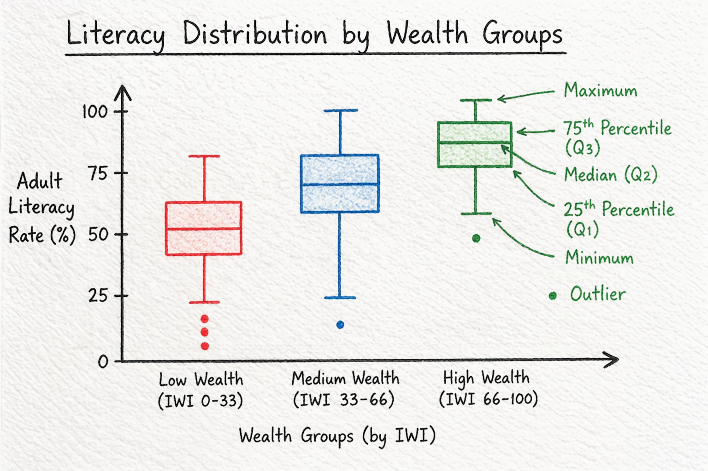
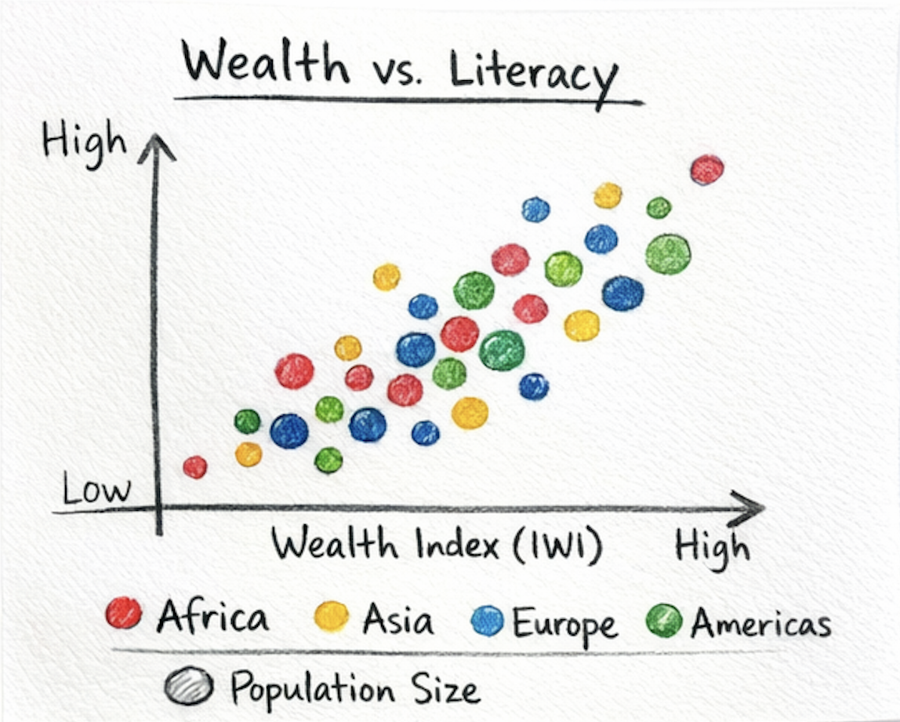
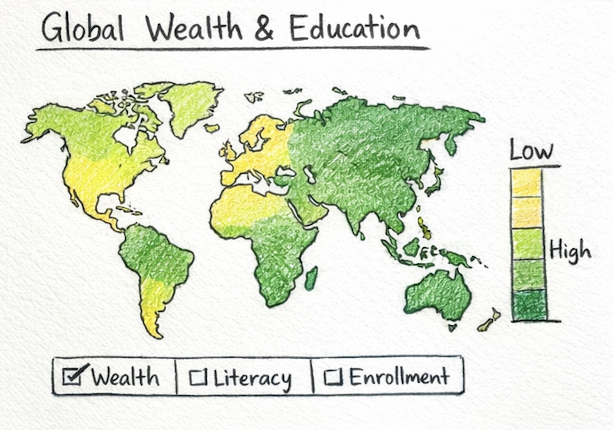

# Global Wealth and Adult Literacy Dashboard

An interactive D3.js coursework dashboard exploring the question:

**How does adult literacy vary with wealth across countries over time?**

The dashboard compares adult literacy rates with International Wealth Index scores across countries, years, and world regions. It is designed as a polished academic data visualization submission, with a box plot as the primary landing view and a scatter plot as a secondary exploratory view.

## Features

- Box plot mode for comparing literacy distributions across low-, medium-, and high-wealth country groups
- Scatter plot mode for exploring the country-level wealth-literacy relationship
- Year slider with active progress styling
- World region filter
- Country highlight search in scatter plot mode
- Reset control
- Collapsible chart explanation, expanded by default
- Median literacy summary chips
- Inline legend
- Trend/distribution summary strip
- Key insight cards
- Styled interactive tooltips

## Project Files

- `index.html` - page structure and dashboard layout
- `style.css` - typography, card hierarchy, controls, chart styling, and responsive layout
- `script.js` - D3 data loading, filtering, chart rendering, interactions, tooltips, and insight text
- `final_dataset.csv` - cleaned dataset used by the dashboard
- `clean_data.py` - preprocessing script used to create the final dataset
- `world-education-data.csv` - original education dataset containing adult literacy and other education indicators
- `GDL-Mean-International-Wealth-Index-(IWI)-score-of-region-data.csv` - original International Wealth Index dataset
- `boxplot_sketch.png`, `scatter_sketch.png`, `map_sketch.png` - concept sketches used during design development

## Concept Sketches

The project began with three visual concept sketches. These were used to compare possible approaches before refining the dashboard around the strongest analytical view.

### Box Plot Concept



The box plot sketch became the primary direction because it clearly compares literacy distributions across low-, medium-, and high-wealth groups. This supports the final dashboard's emphasis on median differences, spread, and outliers.

### Scatter Plot Concept



The scatter plot concept was retained as a secondary exploratory view. It is useful for showing individual countries, the overall wealth-literacy trend, and countries that sit above or below the expected relationship.

### Map Concept



The map concept was considered for geographic storytelling, but it was not used as the main visualization because the research question focuses more directly on the relationship between wealth and literacy than on spatial location alone.

## Dataset Preparation

The dashboard uses `final_dataset.csv`, which was created by cleaning and merging two original datasets:

1. `world-education-data.csv`
2. `GDL-Mean-International-Wealth-Index-(IWI)-score-of-region-data.csv`

The preprocessing is handled by `clean_data.py`.

### Education Dataset

The education dataset includes multiple education indicators by country and year. For this project, the preprocessing keeps only the columns needed for the research question:

- `country`
- `year`
- `lit_rate_adult_pct`

`lit_rate_adult_pct` is renamed to `adult_literacy_rate`. Values are converted to numeric format, and invalid or missing literacy values are removed. Literacy values are kept only if they fall between 0 and 100.

### Wealth Dataset

The wealth dataset contains International Wealth Index values by country, region, and year. The source file stores years as separate columns from 1992 to 2023, so `clean_data.py` converts it from wide format into long format.

The cleaned wealth fields are:

- `country`
- `region`
- `year`
- `wealth_iwi`

Invalid or missing wealth values are removed, and wealth values are kept only if they fall between 0 and 100.

### Merge Process

After both datasets are cleaned:

- country names are normalized
- common country-name mismatches are corrected
- the datasets are merged using `country` and `year`
- rows without valid matching literacy and wealth values are excluded
- missing regions are labelled as `Unknown`
- the final output is sorted by `year`, `wealth_iwi`, and `country`

The resulting `final_dataset.csv` contains:

- `country`
- `region`
- `year`
- `wealth_iwi`
- `adult_literacy_rate`

This final dataset is the only dataset loaded by the D3 dashboard.

To regenerate it:

```bash
python3 clean_data.py
```

## How To Run

Because the dashboard loads `final_dataset.csv`, open it through a local static server rather than directly from the file system.

From this folder:

```bash
python3 -m http.server 8001
```

Then open:

```text
http://localhost:8001/
```

If port `8001` is already in use, choose another port:

```bash
python3 -m http.server 8080
```

and open `http://localhost:8080/`.

## Interaction Notes

- Use the **year slider** to move through available years.
- Use **World region** to filter the countries shown.
- Use **View mode** to switch between Box Plot and Scatter Plot.
- In **Box Plot** mode, click a wealth group or median chip to focus that group.
- In **Scatter Plot** mode, search for a country or click a point to highlight it.
- Click legend items in Scatter Plot mode to focus a region.
- Hover over marks to view detailed tooltips.

## Analytical Focus

The visualization investigates whether countries with higher International Wealth Index values also tend to report higher adult literacy rates. The box plot emphasizes distributional differences between wealth groups, while the scatter plot shows individual country positions and the overall trend line.

## Technical Stack

- HTML
- CSS
- JavaScript
- D3.js v7
